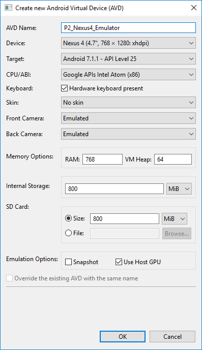
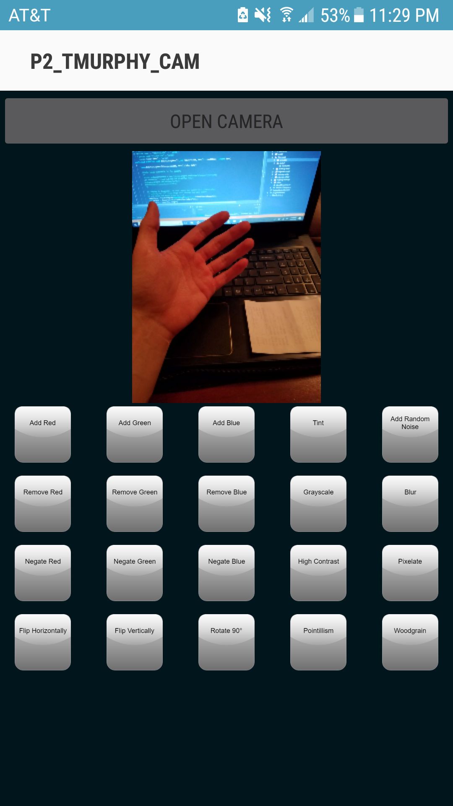
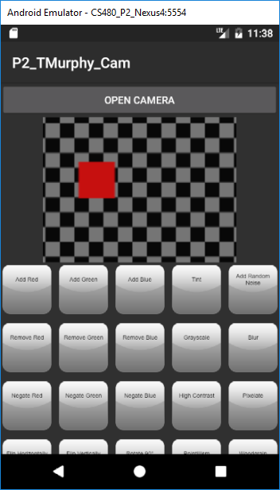

# Image Manipulation
This program is *intended* to manipulate photos taken by an Android camera. Ideally it would also be able to access images pulled from the gallery, and save to the gallery. It's purpose is to help me learn more about writing code in the Anroid environment, especially in regards to image manipulation and requesting permissions regarding phone features.

## System Design 
The idea behind this build is to take the picture, then manipulate it. After taking a picture, 20 buttons should be revealed (4 rows of 5), each able to apply an image manipulation effect. (Except, right now I only have the code for 10 of the 20 functions written. Also, due to very having broken the code sometime in the past few hours none of the functions are being executed properly.) Here's the emulator settings I used, along with a screenshot of the program 'running' on an emulator and a Samsung Galaxy S7 Edge.

## Usage

 
Ideally clicking on any of these 20 buttons would apply the effect. Then perhaps I would work on making it so you could click on the button again to remove the effect. I also wanted to work on replacing the buttons with thumbnail previews, and then lastly implementing sliders so that you could apply the effects in varying degrees. (e.g., remove red 20% and then add just a little noise) As of right now, clicking on any of the buttons that link to actual functions will likely result in a crash. Clicking on one of the 10 buttons that doesn't yet link to a function will only result in a toast message.